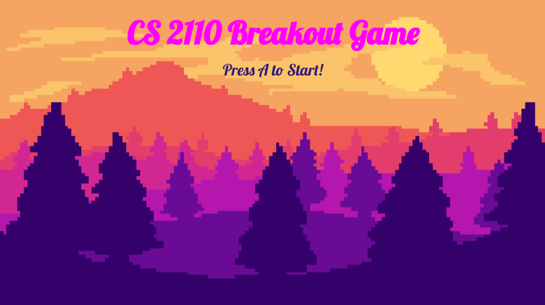

# Breakout Game

- Objective: destroy all rectangles using the ball, given 5 lives
- created for CS2110: Computer Organization and Programming at Georgia Tech with Professor Southern

## Controls:
- Left - move paddle left
- Right - move paddle right
- Select (Backspace on keyboard)- reset to start screen
- A button (Z on keyboard)- used to advance between screens

## Running Game
- download Docker
    - https://docs.docker.com/docker-for-mac/install/ for mac
    - https://docs.docker.com/toolbox/toolbox_install_windows/ for windows
- run `sudo chmod +x ./cs2110docker.sh` in terminal
- run `./cs2110docker.sh`
- open the link that shows up in the terminal
- cd into `host`, and then into the directory where the C files are located
- run `make med` to run the emulator!